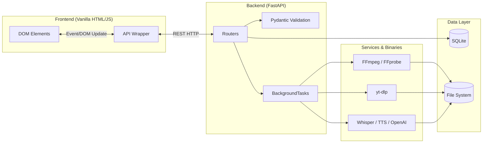
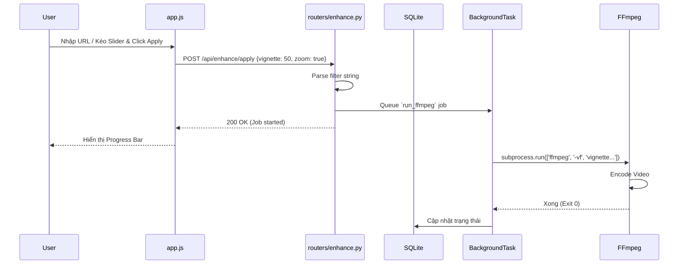

# Sơ đồ Kiến trúc

## 1. System Architecture

```mermaid
flowchart LR
    subgraph UI["Frontend (Vanilla HTML/JS)"]
        DOM[DOM Elements]
        API[API Wrapper]
    end

    subgraph API_Layer["Backend (FastAPI)"]
        Router[Routers]
        Schema[Pydantic Validation]
        BG[BackgroundTasks]
    end

    subgraph Core["Services & Binaries"]
        FF[FFmpeg / FFprobe]
        YTD[yt-dlp]
        AI[Whisper / TTS / OpenAI]
    end

    subgraph Storage["Data Layer"]
        DB[(SQLite)]
        FS[(File System)]
    end

    DOM <-->|Event/DOM Update| API
    API <-->|REST HTTP| Router
    Router --> Schema
    Router --> DB
    Router --> BG
    BG --> FF & YTD & AI
    FF & YTD & AI --> FS
```

## 2. Data Flow (Tải Video & Nâng cấp hình ảnh)

```mermaid
sequenceDiagram
    participant User
    participant AppJS as app.js
    participant Router as routers/enhance.py
    participant DB as SQLite
    participant Worker as BackgroundTask
    participant FF as FFmpeg

    User->>AppJS: Nhập URL / Kéo Slider & Click Apply
    AppJS->>Router: POST /api/enhance/apply {vignette: 50, zoom: true}
    Router->>Router: Parse filter string
    Router->>Worker: Queue `run_ffmpeg` job
    Router-->>AppJS: 200 OK (Job started)
    AppJS-->>User: Hiển thị Progress Bar
    
    Worker->>FF: subprocess.run(['ffmpeg', '-vf', 'vignette...'])
    FF->>FF: Encode Video
    FF-->>Worker: Xong (Exit 0)
    Worker->>DB: Cập nhật trạng thái
```
